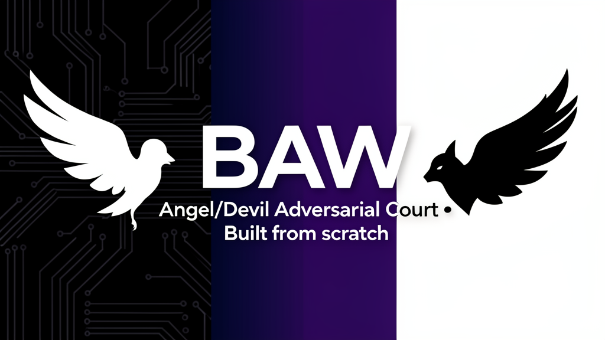
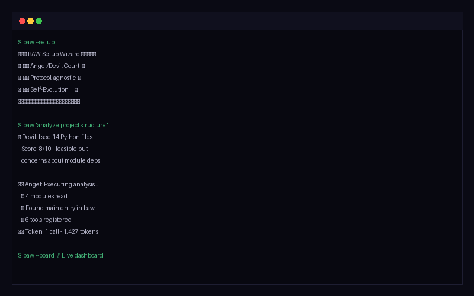

<!--
╔══════════════════════════════════════════════════════════╗
║  BAW — Black And White Agent Platform                   ║
║  Bilingual README (English + Traditional Chinese)        ║
╚══════════════════════════════════════════════════════════╝
-->

<br>
<p align="center">
  
</p>

<p align="center">
  
  
  
  
  
  
</p>

<h1 align="center">⚫ BAW — Black And White ⚪</h1>
<p align="center"><strong>No LangChain. No AutoGPT. Just a courtroom of Angels and Devils debating every agent call.</strong></p>
<p align="center"><sub><em>Built from scratch • 由零打造 • 100% vendor-agnostic • Cost-transparent</em></sub></p>

<p align="center">
  🤍🖤 Angel/Devil Dual-Soul Court • Self-Evolution • Multi-Model Fusion • Telegram Bot<br>
  🤍🖤 Angel/Devil 雙魂法庭 • 自我進化 • 多模型融合 • Telegram Bot
</p>

---

## ⚔️ Why BAW? (vs The Alternatives)

<p align="center">
  
  <br><em>BAW in action — CLI setup wizard + project analysis with built-in Angel/Devil court</em>
</p>

| | BAW (this) | LangChain / LangGraph | CrewAI | AutoGen | OpenAI Agents SDK |
|---|---|---|---|---|---|
| **Architecture** | 100% from scratch | Wraps dozens of libs | Wraps LangChain | Wraps OpenAI | Proprietary |
| **Lock-in** | Zero — swap any provider | Heavy framework lock-in | Heavy framework lock-in | Heavy OpenAI lock-in | Total OpenAI lock-in |
| **Execution Guard** | 🤍🖤 Angel/Devil adversarial court | ❌ None | ❌ None | ❌ None | ❌ None |
| **Code size** | ~15K LOC | 500K+ LOC | ~100K LOC | ~100K LOC | Closed |
| **Cost Transparency** | ✅ Token cost per message | ❌ None | ❌ None | ❌ None | ❌ None |
| **Self-Evolution** | ✅ Learn skills + optimize | ❌ None | ❌ None | ❌ None | ❌ None |
| **Auto-Heal** | ✅ 3-layer ModuleNotFoundError auto-fix | ❌ None | ❌ None | ❌ None | ❌ None |
| **Multi-Platform Bot** | Telegram / Discord / Slack / Signal | ❌ None | ❌ None | ❌ None | ❌ None |
| **Setup** | `pip install` + `baw --setup` | Complex chains | Complex setup | Multiple installs | API-dependent |
| **License** | MIT | MIT | MIT | MIT (older) | Proprietary |

---

## 🔄 完全獨立 (Full Independence)

BAW v1.18.0 係一個完全獨立嘅 Agent Platform — 唔需要第二個系統介入設定或 setup。

| Phase | 能力 | Tools |
|-------|------|-------|
| 1 — Code Management | Git commit/push/build/restart via self-evolution | self-evolve pipeline |
| 2 — Self Operation | System health, diagnostics, cron scheduler, auto-cleanup | `--doctor`, cron jobs |
| 3 — Self Knowledge | SOUL.md, ARCHITECTURE.md, capability discovery | `--capabilities`, `--learn-skill` |
| 4 — Self Extension | LLM-generated tools, auto-register, smoke test | `--learn-skill`, tool registry |
| 5 — Self Hosting | install.sh bootstrap on any Linux, Bare metal systemd deployment | install.sh, systemd |

### ⚡ Bare Metal Install (Recommended)

```bash
# 1. Clone the repo
git clone https://github.com/cornreform/baw-agent-platform.git ~/BAW
cd ~/BAW

# 2. Create virtual environment
python3 -m venv venv
source venv/bin/activate

# 3. Install dependencies
pip install -r requirements.txt

# 4. Set up config
mkdir -p ~/.baw
cp SOUL.md ~/.baw/
cp config.sample.yaml ~/.baw/config.yaml

# 5. Install CLI wrapper (so 'baw' works from anywhere)
sudo tee /usr/local/bin/baw << '''EOF'''
#!/bin/bash
BAW_DIR="${BAW_HOME:-$HOME/BAW}"
cd "$BAW_DIR" || exit 1
export PYTHONPATH="$BAW_DIR:$PYTHONPATH"
# Route subcommands to Rich CLI, flags to old script
case "${1:-}" in
  ""|chat|tui-chat|status|models|config|router|soul|logs|dashboard|setup|memory|todo|tools|sessions|evolve|court|skill|restart|rebuild|self-test|preflight)
    exec "$BAW_DIR/venv/bin/python3" -m cli.main "$@" ;;
  *)
    exec "$BAW_DIR/venv/bin/python3" "$BAW_DIR/baw" "$@" ;;
esac
EOF
sudo chmod 755 /usr/local/bin/baw

# 6. Run setup wizard (configures API keys, model, Telegram token)
baw --setup

# 7. Start BAW
systemctl --user enable --now baw
```

---


<!-- ═══ English ═══ -->
<h2>📖 English</h2>

<h3>What is BAW?</h3>

<p><strong>BAW (Black And White)</strong> is an agent platform built entirely from scratch — no LangChain, no AutoGPT, no vendor framework. Named after two dogs (black & white), it embodies the core philosophy of <strong>🤍 Angel (executor)</strong> vs <strong>🖤 Devil (opposition)</strong> courtroom-style adversarial debate.</p>

<p>We built BAW for our own use — an AI agent platform that combines multi-model LLM orchestration with a built-in adversarial court system that reviews every action before execution. Every model call, tool invocation, and file write runs through an Angel/Devil debate before anything happens. It is not a framework wrapper; it is an autonomous LLM agent platform built from scratch, designed to run independently without vendor lock-in or external dependencies. If that sounds useful to you, you are welcome to use it too.</p>

<h3>🚀 Quick Start</h3>

<pre>
# Install
git clone https://github.com/cornreform/baw-agent-platform.git
cd baw-agent-platform
pip install -r requirements.txt
ln -sf $PWD/baw ~/.local/bin/baw

# Interactive setup wizard (英文)
baw --setup

# Or manually add an API key
echo "STEPFUN_API_KEY=***" >> ~/.baw/.env

# ✨ Go!
baw "list files in current directory"
baw --doctor           # Health check
baw --update           # Pull latest + restart service
baw                    # Interactive Chat mode
</pre>

<blockquote>
<strong>💡 First time?</strong><br>
Run <code>baw --setup</code> — it walks through Telegram token, default model, API keys, auto-configures providers + STT + TTS + vision.<br>
<strong>Plan selection:</strong> setup asks about your plan type (standard / step-plan / code-plan / etc.) — never hardcodes endpoints.
</blockquote>

<h3>💻 CLI Demo</h3>

<pre>
$ baw --version
BAW (Black And White) Agent Platform v1.18.0
Commit: 807a933 (v1.18.0)
Home: /app
Architecture: self-improving loop with Angel/Devil adversarial court

$ baw --help
🖤  BAW CLI — Black And White Agent Platform

  All commands run as systemd user service.
  Pass --help to see full command reference.

  Quick start:
    baw              # Interactive chat
    baw tui-chat     # Full-screen TUI chat
    baw dashboard    # Live dashboard
    baw status       # Health overview
    baw --help       # Full command reference (inside container)
</pre>

<h3>🔧 Prerequisites</h3>

<table>
  <tr><th>Requirement</th><th>Check / Install</th></tr>
  <tr><td>Python 3.11+</td><td><code>python3 --version</code> — if missing: <code>brew install python@3.12</code> (macOS) or <code>sudo apt install python3.12</code> (Linux)</td></tr>
  <tr><td>Git</td><td><code>git --version</code> — if missing: <code>brew install git</code> (macOS) or <code>sudo apt install git</code> (Linux)</td></tr>
  <tr><td>pip</td><td><code>python3 -m pip --version</code> — if missing: <code>python3 -m ensurepip --upgrade</code></td></tr>
  <tr><td>~/.local/bin in PATH</td><td><code>echo $PATH</code> should include <code>~/.local/bin</code></td></tr>
  </table>

<h3>🤖 One-Command Install</h3>

<pre>
# 1. Clone
git clone https://github.com/cornreform/baw-agent-platform.git ~/BAW
cd ~/BAW

# 2. Venv + deps
python3 -m venv venv
source venv/bin/activate
pip install -r requirements.txt

# 3. Config
mkdir -p ~/.baw
cp SOUL.md ~/.baw/
cp config.sample.yaml ~/.baw/config.yaml

# 4. Install CLI wrapper
sudo tee /usr/local/bin/baw << '''EOF'''
#!/bin/bash
BAW_DIR="${BAW_HOME:-$HOME/BAW}"
cd "$BAW_DIR" || exit 1
export PYTHONPATH="$BAW_DIR:$PYTHONPATH"
# Route subcommands to Rich CLI, flags to old script
case "${1:-}" in
  ""|chat|tui-chat|status|models|config|router|soul|logs|dashboard|setup|memory|todo|tools|sessions|evolve|court|skill|restart|rebuild|self-test|preflight)
    exec "$BAW_DIR/venv/bin/python3" -m cli.main "$@" ;;
  *)
    exec "$BAW_DIR/venv/bin/python3" "$BAW_DIR/baw" "$@" ;;
esac
EOF
sudo chmod 755 /usr/local/bin/baw

# 5. Setup wizard
baw --setup

# 6. Start
systemctl --user enable --now baw
</pre>

<h3>🎯 Core Features</h3>

<table>
  <tr><th>Feature</th><th>Description</th></tr>
  <tr><td>⚖️ Angel/Devil Court</td><td>Devil speaks first with ZERO execution power. Angel listens then acts. Devil score > Angel → STOP</td></tr>
  <tr><td>🧠 Never Surrender</td><td>Fail → retry → replan → rollback. Exhausts 6 strategies before reporting</td></tr>
  <tr><td>🔌 Protocol-agnostic LLM</td><td>OpenAI / Anthropic / Google protocols. One-line config switch, built-in cost tracking</td></tr>
  <tr><td>⚙️ 3 Execution Modes</td><td>Quick (fastest) / Hybrid (balanced) / Tight (full court+plan+verify)</td></tr>
  <tr><td>🗣️ 6 Tone Profiles</td><td>casual / business / teaching / client-doc / ot-rt / stepwise</td></tr>
  <tr><td>📝 Self-Learning Skills</td><td><code>--learn-skill</code> auto-analyzes and generates YAML skill</td></tr>
  <tr><td>🔄 Cron Scheduler</td><td>Cron-expression scheduled tasks, 60s background daemon</td></tr>
  <tr><td>📁 Background Tasks</td><td><code>--delegate</code> runs in background, main terminal freed instantly</td></tr>
  <tr><td>🐙 GitHub Integration</td><td>issues / PRs / CI / repos directly from CLI</td></tr>
  <tr><td>🔍 Open Search Provider</td><td>Built-in DuckDuckGo (free), pluggable upgrade</td></tr>
  <tr><td>💾 Multi-Layer Memory Network</td><td>JSONL persistent store + edges.json graph (Jaccard 2-hop) + auto-scoring (access boost + time decay) + auto-compression (group similar → summarize)</td></tr>
  <tr><td>🧬 Self-Evolution</td><td>3-layer learning: behavior tracking → pattern detection → auto-optimize</td></tr>
  <tr><td>🤖 Agent Delegation</td><td>Main brain decomposes tasks → sub-agents execute → synthesises</td></tr>
  <tr><td>🔄 Hot Reload</td><td><code>/reload</code> reloads tools/config/SOUL without restarting</td></tr>
  <tr><td>🎙️ Voice STT</td><td>Telegram voice auto-detected: auto-probes OpenAI / SSE protocols, local faster-whisper fallback</td></tr>
  <tr><td>🔧 Tool Self-Config</td><td>BAW discovers & registers its own CLI tools</td></tr>
  <tr><td>🛡️ 3-Level Permission Engine</td><td>High (block) / Medium (warn) / Low (allow)</td></tr>
  <tr><td>🗺️ Route Plan Execution</td><td>Multi-step plan with 60s timeout + anti-stuck skip</td></tr>
  <tr><td>🎯 Per-Task Model Routing</td><td>keyword matching routes sub-agents to optimal models</td></tr>
  <tr><td>🏛️ Tribunal Consensus</td><td>Multi-model courtroom — judges evaluate independently, Chief Justice unifies verdict</td></tr>
  <tr><td>🧪 Real-World Validator</td><td>Zero-mock validation — real API calls, real file writes, real execution verification</td></tr>
  <tr><td>🧘 Self-Evolution</td><td>4-phase learning: behavior tracking → health monitor → auto-fix → pattern optimization</td></tr>
  <tr><td>📊 HTML Dashboard</td><td><code>--board</code> generates dark-themed system dashboard</td></tr>
  <tr><td>📁 File History + Auto Git</td><td>Every write logged with SHA256 + auto commit</td></tr>
  <tr><td>👨‍⚕️ Doctor Health Check</td><td><code>--doctor [--fix]</code> — validate config, deps, disk, API keys</td></tr>
  <tr><td>🔄 Self-Update</td><td><code>--update</code> — git pull + restart</td></tr>
  <tr><td>📦 Backup & Restore</td><td><code>--backup</code> / <code>--restore</code> — config, .env, memory, sessions</td></tr>
  <tr><td>📎 Auto MEDIA Delivery</td><td>Detects generated files in output, auto-sends via MEDIA: tag — agent never says 'can't attach'</td></tr>
  <tr><td>🔍 Complete Model Discovery</td><td>Auto-probes multiple endpoint paths (/v1/models) to discover ALL provider models, dedup across URLs</td></tr>
  <tr><td>🆓 DuckDuckGo Fallback</td><td>Free built-in search provider via ddgs — no API key, out-of-box, fallback for any configured provider</td></tr>
  <tr><td>👤 Profile Management</td><td><code>--profile-*</code> — isolated instances with independent configs</td></tr>
  <tr><td>🔬 Diagnostics</td><td><code>--diagnostics</code> — system debug info dump</td></tr>
  <tr><td>🔐 Reset</td><td><code>--reset</code> — factory reset with confirmation</td></tr>
  <tr><td>🐚 Shell Completion</td><td><code>--completion bash|zsh</code> — tab completion</td></tr>
</table>

<h3>Plan-Based Endpoint Selection</h3>

<p>BAW asks about your plan type when adding API keys. Never hardcodes endpoints:</p>

<table>
  <tr><th>Provider</th><th>Plans</th><th>Base URL</th></tr>
  <tr><td>Stepfun</td><td>Standard / Step Plan / China</td><td><code>api.stepfun.ai/v1</code> / <code>step_plan/v1</code> / <code>stepfun.com/v1</code></td></tr>
  <tr><td>Kimi/Moonshot</td><td>Standard / Code Plan</td><td><code>api.moonshot.ai/v1</code></td></tr>
  <tr><td>MiniMax</td><td>Standard / Subscription</td><td><code>api.minimax.io/v1</code></td></tr>
</table>

<h3>⚙️ Full Command Reference</h3>

<pre>
# Core Agent
baw "prompt"                     # Run agent (single-shot)
baw                              # Interactive Chat mode
baw --mode quick/hybrid/tight    # Execution mode
baw --tone &lt;profile&gt;             # Tone override
baw --model &lt;id&gt;                # Model override
baw --verbose                    # Verbose output + cost
baw --dry-run                    # Dry run (no changes)
baw --btw "question"             # Quick LLM question

# Background Tasks
baw --delegate "task"            # Background task
baw --task-id &lt;id&gt;              # Check task status
baw --tasks                      # List background tasks
baw --task-cancel &lt;id&gt;          # Cancel background task

# Setup & Config
baw --setup                      # Interactive setup wizard (英文)
baw --cfg list                   # Show all settings
baw --cfg get &lt;key&gt;             # Query a setting
baw --cfg set &lt;key&gt; &lt;value&gt;     # Change immediately
baw --cfg edit                   # Open in $EDITOR
baw --cfg path                   # Show config path
baw --cfg env-path               # Show .env path
baw --cfg check                  # Validate required sections

# Health & Maintenance
baw --doctor                     # Health check
baw --doctor --fix               # Health check + auto-repair
baw --update                     # Pull latest + restart service
baw --version                    # Version + build info
baw --diagnostics                # System debug info
baw --logs [N]                   # View journal logs (N lines)
baw --reset                      # Factory reset

# Memory & Sessions
baw --remember "text"            # Save memory
baw --search "query"             # Search memory
baw --memory-stats               # Memory store statistics
baw --dream                      # Self-curation

# Profiles & Backups
baw --profile-list               # List profiles
baw --profile-create &lt;name&gt;     # Create profile
baw --profile-use &lt;name&gt;        # Switch profile
baw --profile-delete &lt;name&gt;     # Delete profile
baw --backup                     # Backup all data
baw --restore [path]             # Restore from backup

# Skills
baw --skill-list                 # List skills
baw --skill-run &lt;name&gt;          # Run a skill
baw --learn-skill "desc"         # Self-learn skill from description
baw --learn-url &lt;url&gt;           # Learn skill from URL

# Integrations
baw --gh issues|prs|ci|repos     # GitHub operations
baw --board                      # HTML Dashboard
baw --search-provider list|test  # Search provider mgmt
baw --schedule-list|add|rm       # Schedule management
baw --completion bash|zsh        # Shell completion

# Tools
baw --tools-list                 # List registered tools
baw --status                     # System status
</pre>

<h3>🏗️ Architecture</h3>

<pre>
baw/                        ← Code repo
├── baw                     CLI entrypoint (Python)
├── baw-bot                 Bot daemon entrypoint
├── core/                   Core modules
│   ├── loop.py             Agent loop (plan → execute → report)
│   ├── llm.py              Multi-protocol LLM abstraction
│   ├── adversarial.py      Angel/Devil dual-soul court
│   ├── tools.py            Tool registry
│   ├── permission.py       3-level permission engine
│   ├── memory.py           JSONL memory + scoring
│   ├── fact_checker.py     3-mode fact verification
│   ├── tone.py             Tone profiles
│   ├─── scheduler.py        Cron scheduler daemon
│   ├─── tribunal.py         Tribunal consensus engine
│   ├─── validator.py        Real-world validator (zero-mock)
│   ├─── test_runner.py      Telegram test suite
│   ├─── watchdog.py         Health monitor + emergency cleanup
│   ├─── skills.py           YAML skill system
│   ├─── learn.py            Self-learning skills
│   ├─── board.py            HTML Dashboard generator
│   ├─── task_manager.py     Async task manager
│   ├─── github.py           GitHub integration
│   ├─── search.py           Open search provider registry
│   ├─── setup.py            Setup wizard + Config CLI
│   ├─── commands.py         Slash commands
│   ├─── display.py          Step display formatter
│   ├─── dream.py            Weekly self-curation + self-evolution
│   ├─── evolve.py           3-layer self-evolution engine
│   ├─── checkpoint.py       Checkpoint / rollback
│   └─── degradation.py      Tool degradation chains
│   ├── file_history.py     File SHA256 history
│   ├── autosave.py         Auto git commit
│   ├── render.py           HTML renderer
│   ├── verifier.py         Per-step LLM verification
│   ├── doctor.py           Health check (--doctor)
│   ├── update.py           Self-update + version
│   ├── backup.py           Backup & restore
│   ├── profile.py          Profile management
│   └── diagnostics.py      System diagnostics
├── tools/                  Built-in tools
│   ├── bash.py             Shell execution
│   ├── read_file.py        File reading
│   ├── write_file.py       File writing
│   ├── web_search.py       Web search
│   ├── web_extract.py      Web content extraction
│   ├── search_files.py     Codebase search (ripgrep)
│   ├── patch.py            Targeted find-replace editing
│   ├── memory.py           Memory read/write/search
│   ├── todo.py             Task list management
│   ├── delegate_task.py    Sub-agent delegation
│   ├── vision.py           Image analysis (MiniMax)
│   ├── browser.py          Web automation (stub)
│   ├── image_generate.py   AI image generation (stub)
│   ├── tts.py              Text-to-speech (MiniMax)
│   └── execute_code.py     Python sandbox (stub)
├── config.yaml             Default config
├── SETUP.md                First-install quickstart
├── SOUL.default.md         Template SOUL.md for new profiles
└── docs/                   GitHub Pages documentation

~/.baw/                     ← User data directory
├── config.yaml             User config
├── SOUL.md                 Soul / behaviour rules
├── ORCHESTRATOR.md         Sub-agent optimization rules
├── .env                    API keys
├── memory/store.jsonl      Memory storage
├── skills/*.yaml           Custom skills
├── tasks/                  Background task output
├── sessions/               Session transcripts
├── backups/                Backup archives
└── profiles/               Multi-profile directories
</pre>

<h3>🔧 Configuration</h3>

<pre>
# Interactive setup wizard (recommended for first time)
baw --setup

# Real-time Config CLI
baw --cfg list                    # Show all settings
baw --cfg get model.default       # Query a setting
baw --cfg set capabilities.stt.method auto-asr
baw --cfg set capabilities.tts.model stepaudio-2.5-tts
baw --cfg edit                    # Open in $EDITOR
baw --cfg check                   # Validate required sections
</pre>

<h3>📡 Multi-Platform Messaging</h3>

<p>BAW connects to messaging platforms via the <code>baw-bot</code> daemon:</p>

<table>
  <tr><th>Platform</th><th>Status</th><th>Setup</th></tr>
  <tr><td>📱 Telegram</td><td>✅ Full (voice STT, TTS, images)</td><td><code>@BotFather</code> → token → <code>baw-bot</code></td></tr>
  <tr><td>💬 Discord</td><td>✅ Full support</td><td>Discord Developer Portal → token → prefix</td></tr>
  <tr><td>💚 Slack</td><td>✅ Socket Mode (no public URL)</td><td>Slack API → bot + app token</td></tr>
  <tr><td>📢 Signal</td><td>⚙️ signal-cli required</td><td><code>signal-cli</code> daemon + config</td></tr>
  <tr><td>💚 WhatsApp</td><td>⚙️ Cloud/Business API</td><td>Meta Developer account → webhook</td></tr>
  <tr><td>🧩 Matrix</td><td>✅ Full support</td><td>Any Matrix account + homeserver</td></tr>
</table>

<pre>
# Start all configured connectors
baw-bot

# Start specific platform
baw-bot --platform telegram
baw-bot --platform discord
baw-bot --platform slack

# List available connectors
baw-bot --list

# Quick setup with CLI token
baw-bot --token "YOUR_TELEGRAM_TOKEN"</pre>

<h4>Platform Quick Setup</h4>

<details>
<summary>📱 Telegram</summary>
<ol>
  <li>Message <code>@BotFather</code> on Telegram → <code>/newbot</code></li>
  <li>Copy the token (looks like <code>123456:ABC-DEF...</code>)</li>
  <li>Run <code>baw --setup</code> → select Telegram → paste token</li>
  <li>Start: <code>baw-bot</code></li>
</ol>
</details>

<details>
<summary>💬 Discord</summary>
<ol>
  <li>Go to <a href="https://discord.com/developers/applications">Discord Developer Portal</a> → New Application → Bot</li>
  <li>Enable "Message Content Intent"</li>
  <li>Copy Bot Token</li>
  <li>Run <code>baw --setup</code> → select Discord → paste token → set prefix</li>
  <li>Invite bot to your server with <code>bot</code> + <code>Send Messages</code> scopes</li>
  <li>Start: <code>baw-bot --platform discord</code></li>
</ol>
</details>

<details>
<summary>💚 Slack (Socket Mode)</summary>
<ol>
  <li>Go to <a href="https://api.slack.com/apps">Slack API</a> → Create New App → From scratch</li>
  <li>Enable <strong>Socket Mode</strong> → Generate App-Level Token (scope: <code>connections:write</code>)</li>
  <li>OAuth & Permissions → Add Bot Token Scopes: <code>chat:write</code>, <code>app_mentions:read</code>, <code>im:history</code></li>
  <li>Install to workspace → copy <strong>Bot User OAuth Token</strong> (<code>xoxb-...</code>)</li>
  <li>Basic Info → copy <strong>App-Level Token</strong> (<code>xapp-...</code>)</li>
  <li>Run <code>baw --setup</code> → select Slack → paste both tokens</li>
  <li>Start: <code>baw-bot --platform slack</code></li>
</ol>
</details>

<details>
<summary>🧩 Matrix</summary>
<ol>
  <li>Register account on any homeserver (e.g. <a href="https://matrix.org">matrix.org</a>)</li>
  <li>Get access token: Settings → Help & About → Access Token</li>
  <li>Run <code>baw --setup</code> → select Matrix → enter homeserver + username + token</li>
  <li>Start: <code>baw-bot --platform matrix</code></li>
</ol>
</details>

<details>
<summary>📢 Signal</summary>
<ol>
  <li>Install <code>signal-cli</code>: <code>https://github.com/AsamK/signal-cli</code></li>
  <li>Register: <code>signal-cli -u +1555... register</code></li>
  <li>Verify: <code>signal-cli -u +1555... verify &lt;code&gt;</code></li>
  <li>Start daemon: <code>signal-cli -u +1555... daemon</code></li>
  <li>Run <code>baw --setup</code> → select Signal → enter phone number</li>
  <li>Start: <code>baw-bot --platform signal</code></li>
</ol>
</details>

<details>
<summary>💚 WhatsApp</summary>
<ol>
  <li>Go to <a href="https://developers.facebook.com">Meta Developers</a> → Create App → WhatsApp → Setup</li>
  <li>Copy <strong>Phone Number ID</strong> and <strong>Permanent Access Token</strong></li>
  <li>Configure webhook endpoint (requires public URL + reverse proxy)</li>
  <li>Run <code>baw --setup</code> → select WhatsApp → paste token + phone ID</li>
  <li>Start: <code>baw-bot --platform whatsapp</code></li>
</ol>
</details>

<hr>

<!-- ═══ 繁體中文 ═══ -->
<h2>📖 繁體中文</h2>

<h3>BAW 係咩？</h3>

<p><strong>BAW (Black And White)</strong> 係一套由零開始構建嘅 Agent Platform，唔依賴 LangChain、AutoGPT、或任何現有 framework。系統嘅核心哲學：<strong>🤍 Angel（執行者）</strong> vs <strong>🖤 Devil（反對派）</strong> 嘅法庭式對抗。</p>

<h3>🚀 Quick Start</h3>

<pre>
# 安裝
git clone https://github.com/cornreform/baw-agent-platform.git
cd baw-agent-platform
pip install -r requirements.txt
ln -sf $PWD/baw ~/.local/bin/baw

# 互動式設定精靈（英文界面）
baw --setup

# 或直接加 API Key
echo "STEPFUN_API_KEY=*** >> ~/.baw/.env

# ✨ 即刻用！
baw "list files in current directory"
baw --doctor           # 健康檢查
baw --update           # 更新 + 重啟服務
baw                    # 互動式 Chat 模式
</pre>

<blockquote>
<strong>💡 第一次用？</strong><br>
執行 <code>baw --setup</code> — 設定精靈會逐步行：Telegram token、default model、API keys、自動配置 provider + STT + TTS + vision。<br>
<strong>Plan 選擇：</strong> setup 會問你用緊邊個 plan（標準 / step-plan / code-plan 等），唔會 hardcode endpoint。
</blockquote>

<h3>🔧 系統要求</h3>

<table>
  <tr><th>要求</th><th>檢查／安裝</th></tr>
  <tr><td>Python 3.11+</td><td><code>python3 --version</code> — macOS: <code>brew install python@3.12</code> / Linux: <code>sudo apt install python3.12</code></td></tr>
  <tr><td>Git</td><td><code>git --version</code> — macOS: <code>brew install git</code> / Linux: <code>sudo apt install git</code></td></tr>
  <tr><td>pip</td><td><code>python3 -m pip --version</code></td></tr>
  <tr><td>~/.local/bin in PATH</td><td><code>echo $PATH</code> 應該包含 <code>~/.local/bin</code></td></tr>
  </table>

<h3>🎯 核心特色</h3>

<table>
  <tr><th>特色</th><th>說明</th></tr>
  <tr><td>⚖️ Angel/Devil 法庭</td><td>Devil 永遠先發言，零執行權限；Angel 聽完再行。Devil 分數 > Angel → STOP</td></tr>
  <tr><td>🧠 永不放棄哲學</td><td>失敗 → retry → replan → rollback。6 種策略用盡先上報</td></tr>
  <tr><td>🔌 協議無關 LLM</td><td>OpenAI / Anthropic / Google 協議通吃。一行 config 轉模型</td></tr>
  <tr><td>⚙️ 三種執行模式</td><td>Quick（最快）/ Hybrid（平衡）/ Tight（完整 court+plan+verify）</td></tr>
  <tr><td>🗣️ 6 種語氣 Profile</td><td>casual / business / teaching / client-doc / ot-rt / stepwise</td></tr>
  <tr><td>📝 自我學習技能</td><td><code>--learn-skill</code> 自動分析拆解生成 YAML skill</td></tr>
  <tr><td>🔄 Scheduler 排程</td><td>Cron 表達式定時任務，60s 背景 daemon</td></tr>
  <tr><td>📁 背景 Task</td><td><code>--delegate</code> 背景執行，主 terminal 即時 free</td></tr>
  <tr><td>🐙 GitHub 整合</td><td>issues / PRs / CI / repos 直接操作</td></tr>
  <tr><td>🔍 開放 Search Provider</td><td>內置 DuckDuckGo（免費），可 pluggable 升級</td></tr>
  <tr><td>💾 統一記憶</td><td>JSONL append‑only + edges.json 圖譜 + 2-hop 關聯</td></tr>
  <tr><td>🏛️ Tribunal 共識引擎</td><td>多模型法庭 — 法官獨立判決，首席法官統一意見</td></tr>
  <tr><td>🧪 現實驗證器</td><td>零 mock — 真實 API 呼叫、真實寫檔、真實執行驗證</td></tr>
  <tr><td>🧘 自我進化</td><td>4 階段學習：行為追蹤 → 健康監控 → 自動修復 → 模式優化</td></tr>
  <tr><td>🤖 Agent Delegation</td><td>主腦拆任務 → 子 agent 執行 → 綜合報告</td></tr>
  <tr><td>🎙️ Voice STT</td><td>Telegram 語音自動檢測，auto-probe OpenAI/SSE 協議，本地 faster-whisper fallback</td></tr>
  <tr><td>👨‍⚕️ 健康檢查</td><td><code>--doctor [--fix]</code> — config、依賴、Disk、API key 全面檢查</td></tr>
  <tr><td>🔄 自更新</td><td><code>--update</code> — git pull + 重啟服務 + 重啟</td></tr>
  <tr><td>📦 備份還原</td><td><code>--backup</code> / <code>--restore</code> — 全部資料一鍵打包</td></tr>
  <tr><td>👤 Profile 管理</td><td><code>--profile-*</code> — 獨立設定、記憶、session 隔離</td></tr>
  <tr><td>🔐 出廠重置</td><td><code>--reset</code> — 確認後 wipe 全部數據</td></tr>
</table>

<h3>Plan-Based Endpoint 選擇</h3>

<p>Set up 時會問你用緊邊個 plan，唔會 hardcode endpoint：</p>

<table>
  <tr><th>Provider</th><th>Plans</th><th>Base URL</th></tr>
  <tr><td>Stepfun</td><td>標準 / Step Plan / 內地版</td><td><code>api.stepfun.ai/v1</code> / <code>step_plan/v1</code> / <code>stepfun.com/v1</code></td></tr>
  <tr><td>Kimi/Moonshot</td><td>標準 / Code Plan</td><td><code>api.moonshot.ai/v1</code></td></tr>
  <tr><td>MiniMax</td><td>標準 / 付費計劃</td><td><code>api.minimax.io/v1</code></td></tr>
</table>

<h3>⚙️ 完整指令一覽</h3>

<pre>
# Agent 核心
baw "prompt"                     # 執行 agent（單句模式）
baw                              # 互動式 Chat 模式
baw --mode quick/hybrid/tight    # 執行模式
baw --tone &lt;profile&gt;             # 語氣 override
baw --model &lt;id&gt;                # 模型 override
baw --btw "question"             # 快速一問一答

# Set up & Config
baw --setup                      # 互動設定精靈（英文）
baw --cfg list                   # 顯示所有設定
baw --cfg get &lt;key&gt;             # 查設定
baw --cfg set &lt;key&gt; &lt;value&gt;     # 即時修改
baw --cfg edit                   # 用編輯器改 config
baw --cfg check                  # 驗證必要設定

# 健康維護
baw --doctor                     # 健康檢查
baw --doctor --fix               # 檢查 + 自動修復
baw --update                     # 更新 + 重啟服務
baw --diagnostics                # 系統除錯資訊
baw --logs [N]                   # System logs
baw --version                    # 版本資訊
baw --reset                      # 出廠重置

# 記憶與 Session
baw --remember "text"            # 儲存記憶
baw --search "query"             # 搜尋記憶
baw --memory-stats               # 記憶統計
baw --dream                      # 自我整理

# Profile 與備份
baw --profile-list               # 列出 profiles
baw --profile-create &lt;name&gt;     # 建立 profile
baw --profile-use &lt;name&gt;        # 切換 profile
baw --backup                     # 備份所有數據
baw --restore [path]             # 從備份還原

# Skills
baw --skill-list                 # 列出 skills
baw --learn-skill "desc"         # 自我學習技能
baw --learn-url &lt;url&gt;           # 從 URL 學技能

# 整合功能
baw --gh issues|prs|ci|repos     # GitHub 操作
baw --board                      # HTML Dashboard
baw --schedule-list|add|rm       # 排程管理
baw --completion bash|zsh        # Shell 補全
baw --tools-list                 # 列出 tools
</pre>

<h3>🏗️ 架構</h3>

<pre>
baw/                        ← Code repo
├── baw                     CLI entry point（Python）
├── baw-bot                 Bot daemon entry point
├── core/                   核心模組
│   ├── loop.py             Agent loop（plan → execute → report）
│   ├── llm.py              多協議 LLM abstraction
│   ├── adversarial.py      Angel/Devil 雙魂法庭
│   ├── tools.py            Tool registry
│   ├── permission.py       三級權限引擎
│   ├── memory.py           JSONL 記憶 + 評分
│   ├── fact_checker.py     事實查證（三級）
│   ├─── tone.py             語氣 profile
│   ├─── scheduler.py        Cron 排程 daemon
│   ├─── tribunal.py         Tribunal 共識引擎
│   ├─── validator.py        現實驗證器（零 mock）
│   ├─── test_runner.py      Telegram 測試套件
│   ├─── watchdog.py         健康監控 + 緊急清理
│   ├─── skills.py           YAML skill 系統
│   ├─── learn.py            自我學習技能
│   ├─── board.py            HTML Dashboard
│   ├─── task_manager.py     背景 Task 管理
│   ├─── github.py           GitHub 整合
│   ├─── search.py           開放 search provider
│   ├─── setup.py            設定精靈 + Config CLI
│   ├─── doctor.py           健康檢查 (--doctor)
│   ├─── update.py           自更新 + 版本
│   ├── backup.py           備份還原
│   ├── profile.py          Profile 管理
│   ├── diagnostics.py      系統除錯
│   ├── commands.py         Slash commands
│   ├── display.py          步驟顯示格式化
│   └── dream.py            每週自我整理
├── tools/                  內置工具
│   ├── bash.py             命令執行
│   ├── read_file.py        讀檔案
│   ├── write_file.py       寫檔案
│   ├── web_search.py       Web 搜尋
│   ├── patch.py            精準檔案編輯
│   └── ...（共 15 個 tools）
├── config.yaml             預設配置
├── SETUP.md                首次安裝指南
├── SOUL.default.md         Template SOUL.md
└── docs/                   GitHub Pages 文檔
</pre>

<hr>

<h2>🖥️ CLI Reference</h2>

<p>BAW ships with a full-featured CLI. Just type <code>baw</code> in your terminal.</p>

<h3>🚀 Quick Start</h3>
<pre>baw                  # → Direct interactive chat (default)
baw --help           # → Full help with examples
baw --doctor         # → Health check
baw --setup          # → Guided setup wizard</pre>

<h3>📋 All Commands</h3>

<table>
<tr><th>Command</th><th>Description</th></tr>
<tr><td><code>baw --doctor [--fix]</code></td><td>🩺 Health check + auto-repair</td></tr>
<tr><td><code>baw --setup</code></td><td>🎯 Interactive setup wizard</td></tr>
<tr><td><code>baw --update</code></td><td>🔄 Pull latest + restart service</td></tr>
<tr><td><code>baw --version</code></td><td>📌 Version, commit, branch, Commit SHA</td></tr>
<tr><td><code>baw --backup</code></td><td>💾 Backup config, .env, memory, sessions</td></tr>
<tr><td><code>baw --restore [path]</code></td><td>📂 Restore from backup</td></tr>
<tr><td><code>baw --profile-list</code></td><td>👤 List profiles</td></tr>
<tr><td><code>baw --profile-create &lt;name&gt;</code></td><td>👤 Create profile</td></tr>
<tr><td><code>baw --diagnostics</code></td><td>🔬 System debug info</td></tr>
<tr><td><code>baw --logs [N]</code></td><td>📜 Tail System logs</td></tr>
<tr><td><code>baw --reset</code></td><td>🔐 Factory reset</td></tr>
<tr><td><code>baw --cfg list</code></td><td>⚙️ Show all settings</td></tr>
<tr><td><code>baw --cfg set &lt;k&gt; &lt;v&gt;</code></td><td>⚙️ Change setting</td></tr>
<tr><td><code>baw --cfg edit</code></td><td>⚙️ Open in editor</td></tr>
<tr><td><code>baw --cfg check</code></td><td>⚙️ Validate config</td></tr>
<tr><td><code>baw --board</code></td><td>📊 Generate HTML system dashboard</td></tr>
<tr><td><code>baw --delegate &lt;task&gt;</code></td><td>👥 Background task delegation</td></tr>
<tr><td><code>baw --mode [quick|hybrid|tight]</code></td><td>⚡ Set execution mode</td></tr>
<tr><td><code>baw --tone [casual|business|...]</code></td><td>🎭 Set response tone</td></tr>
<tr><td><code>baw --learn-skill &lt;topic&gt;</code></td><td>📖 Auto-generate YAML skill</td></tr>
<tr><td><code>baw --tribunal &lt;question&gt;</code></td><td>🏛️ Multi-model consensus</td></tr>
<tr><td><code>baw --validate [subcmd]</code></td><td>🧪 Real-world validation</td></tr>
</table>

<h2>🙏 Acknowledgments / 鳴謝</h2>

<p>BAW 嘅開發受以下開源項目同平台啟發，衷心感謝佢哋嘅貢獻。我哋唔想隱瞞任何參考過嘅項目 — 每一樣都為 BAW 帶嚟咗有價值嘅靈感：</p>

<table>
  <tr>
    <th>Project / 項目</th>
    <th>Author / 作者</th>
    <th>啟發咗我哋嘅功能</th>
  </tr>
  <tr>
    <td><a href="https://hermes-agent.nousresearch.com/">🧞 Hermes Agent</a></td>
    <td><a href="https://nousresearch.com/">Nous Research</a></td>
    <td>BAW 本身運行喺 Hermes Agent 之上，用嘅係 Hermes 嘅 profile system、tool execution framework、skills 系統、cron scheduler。我哋嘅 MasterSkills routing 概念亦受 Hermes 嘅 skills loading 機制啟發。Hermes 係我哋嘅 foundation layer。</td>
  </tr>
  <tr>
    <td><a href="https://github.com/openclaw/openclaw">🦞 OpenClaw</a></td>
    <td>OpenClaw Team</td>
    <td>OpenClaw 嘅 agent skill system（SKILL.md router + reference files pattern）直接啟發咗 BAW 嘅 MasterSkills routing + references 設計。Agent Reach 嘅 SKILL.md 三層 router 亦係受 OpenClaw 啟發。</td>
  </tr>
  <tr>
    <td><a href="https://github.com/Panniantong/Agent-Reach">🕵️ Agent Reach</a></td>
    <td><a href="https://github.com/Panniantong">Neo Reid (Panniantong)</a></td>
    <td>本地 HTML→Markdown 提取理念、RSS feed 閱讀、platform health doctor 概念。Agent Reach 嘅「每個 platform 有 preferred + fallback backend」routing 理念啟發咗我哋嘅 web_extract 多層 fallback 設計。37K ⭐ 實至名歸。</td>
  </tr>
  <tr>
    <td><a href="https://jina.ai/reader/">📖 Jina AI Reader</a></td>
    <td><a href="https://jina.ai/">Jina AI</a> (acquired by Elastic)</td>
    <td>ReaderLM-v2 嘅 HTML→Markdown 轉換理念啟發咗我哋用本地 html2text 實現類似效果。雖然我哋最終選擇咗完全本地方案（唔用 r.jina.ai API），但 Jina Reader 證明咗 clean extraction 嘅價值同 token 節省潛力（75-82%）。</td>
  </tr>
  <tr>
    <td><a href="https://clay.com/">🏢 Clay</a></td>
    <td><a href="https://clay.com/">Clay</a></td>
    <td>Waterfall Enrichment pattern（multi-provider lookup with circuit-breaker）啟發咗我哋嘅多源數據檢索思路。雖然我哋嘅實作最終用 delegate_task + web_extract 取代咗專用 enrichment engine，但 Clay 嘅架構理念（sequential provider fallback、circuit-breaker pattern）係重要嘅參考。</td>
  </tr>
</table>

<h3>🧰 Core Libraries & Tools / 核心函式庫</h3>

<p>以下開源函式庫係 BAW 核心功能嘅技術基礎，唔係設計靈感，但冇咗佢哋 BAW 就唔會 work：</p>

<table>
  <tr>
    <th>Library / 函式庫</th>
    <th>Author / 作者</th>
    <th>功能 / 用途</th>
  </tr>
  <tr>
    <td><a href="https://github.com/Alir3z4/html2text">html2text</a></td>
    <td>Alir3z4 (based on Aaron Swartz's original)</td>
    <td>本地 HTML→Markdown 轉換引擎 — web_extract tool 嘅核心</td>
  </tr>
  <tr>
    <td><a href="https://github.com/kurtmckee/feedparser">feedparser</a></td>
    <td>Kurt McKee</td>
    <td>RSS/Atom feed 解析 — rss_feed tool 嘅基礎</td>
  </tr>
  <tr>
    <td><a href="https://github.com/SYSTRAN/faster-whisper">faster-whisper</a></td>
    <td>Guillaume Klein / SYSTRAN</td>
    <td>本地語音識別引擎（CTranslate2-based Whisper）— 本地 STT，毋須外部 API</td>
  </tr>
  <tr>
    <td><a href="https://github.com/rany2/edge-tts">edge-tts</a></td>
    <td>rany2</td>
    <td>本地免費 TTS（Microsoft Edge TTS 封裝）— BAW 預設 TTS provider，支援粵語</td>
  </tr>
  <tr>
    <td><a href="https://github.com/Textualize/textual">Textual</a></td>
    <td>Will McGugan / Textualize</td>
    <td>TUI 框架 — powers baw --board dashboard 同 baw --tui-chat 互動界面</td>
  </tr>
  <tr>
    <td><a href="https://github.com/Textualize/rich">Rich</a></td>
    <td>Will McGugan / Textualize</td>
    <td>Terminal 格式化 — powers 所有 CLI table/panel/syntax highlight 輸出</td>
  </tr>
  <tr>
    <td><a href="https://github.com/modelcontextprotocol/python-sdk">MCP Python SDK</a></td>
    <td>Anthropic</td>
    <td>Model Context Protocol SDK — BAW 連接 MCP server 做 tool discovery</td>
  </tr>
  <tr>
    <td><a href="https://github.com/fastapi/fastapi">FastAPI</a></td>
    <td>Sebastián Ramírez (tiangolo)</td>
    <td>Web framework — Telegram webhook mode 嘅 async transport layer</td>
  </tr>
  <tr>
    <td><a href="https://github.com/encode/uvicorn">Uvicorn</a></td>
    <td>Encode / Tom Christie</td>
    <td>ASGI server — 執行 FastAPI webhook server</td>
  </tr>
  <tr>
    <td><a href="https://www.openstreetmap.org/">🗺️ OpenStreetMap / Overpass API</a></td>
    <td>OpenStreetMap Foundation</td>
    <td>免費地理數據源 — BAW 嘅 geospatial query 同 location/restaurant search 基礎</td>
  </tr>
  <tr>
    <td><a href="https://github.com/AsamK/signal-cli">signal-cli</a></td>
    <td>AsamK</td>
    <td>Signal 通訊 CLI — BAW 嘅 Signal messaging platform 整合依賴</td>
  </tr>
</table>

<p>BAW 本身都係 MIT License 開源項目 — 歡迎參考、改進、分享。我哋嘅理念係：如果一個開源項目幫過我哋，我哋就有責任公開鳴謝，並且將同樣嘅 open 精神傳遞落去。</p>

<hr>

<h2>📝 Changelog</h2>

<h3>v1.18.0 — 自我修復依賴 + 穩定 Telegram 輪詢 (2026-06-24)</h3>
<ul>
  <li>🛡️ <strong>自我修復依賴系統</strong> — 3 層 safety net：tool 執行 auto-install、connector import wrapper、startup main() wrapper，ModuleNotFoundError 自動 pip install + retry</li>
  <li>🔗 <strong>Telegram 409 Conflict 根因修復</strong> — 刪除危險嘅 logOut() API，connect() 加 resilient retry + close() + deleteWebhook</li>
  <li>🐳 <strong>Dockerfile 全面 dep baking</strong> — html2text, websocket-client, croniter, requests, beautifulsoup4 baked in；chown 權限 fix 令非 root pip install 可行</li>
  <li>🧠 <strong>MASTERSKILLS.md 行為規則擴充</strong> — rule #4 自動修復優先、rule #5 Error 要 actionable、NEVER call logOut()</li>
</ul>

<h3>v1.14.14 — 完全本地 web_extract + AI Research + RSS tools</h3>
<ul>
  <li>web_extract 重寫：html2text + BeautifulSoup 本地提取，68-78% token 節省，零外部 API</li>
  <li>ai_research — 新 built-in tool：URL + question → 結構化 JSON research</li>
  <li>rss_feed — 新 built-in tool：feedparser 本地 RSS/Atom feed 閱讀</li>
  <li>鳴謝：Agent Reach (Panniantong) 啟發咗本地 extraction + RSS 方案</li>
  <li>鳴謝：Jina AI Reader 啟發咗 HTML→Markdown 轉換概念</li>
  <li>鳴謝：Clay 啟發咗 waterfall enrichment 多源查詢思路</li>
</ul>
<ul>
  <li>Version sync: all files now report v1.18.0</li>
  <li>Community health files: CONTRIBUTING.md + issue templates added</li>
  <li>README: GitHub stars/last-commit badges, CLI demo section, humility-toned description</li>
  <li>CHANGELOG.md: v1.8-v1.14 entries appended with detailed content</li>
  <li>GitHub: repo description + topics + releases (v1.8-v1.14) all updated</li>
</ul>

<h3>v1.12.0</h3>
<ul>
  <li>Anti-Stuck mechanism — route replan on execution deadlock</li>
  <li>Route Plan Engine — step-by-step plan with rollback support</li>
  <li>Telegram bot deep integration with async message queue</li>
</ul>

<h3>v1.10.0</h3>
<ul>
  <li>Angel/Devil Dual-Soul Court — multi-model adversarial debate</li>
  <li>Tribunal consensus engine — multi-model court judgment</li>
  <li>Real-world validator — zero mock, real API + file validation</li>
  <li>Hallucination Guard — detect &amp; block fake execution promises</li>
</ul>

<h3>v1.8.0</h3>
<ul>
  <li>Direct Execution Shortcuts — bypass LLM for common commands</li>
  <li>Setup wizard rewrite — API key live test, plan auto-detect</li>
  <li>CLI install flow overhaul — auto uv, Python, PATH setup</li>
</ul>
